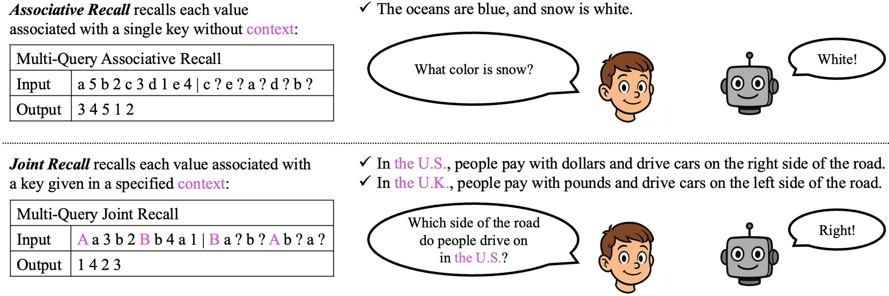
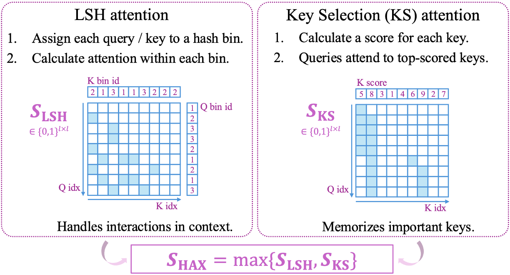
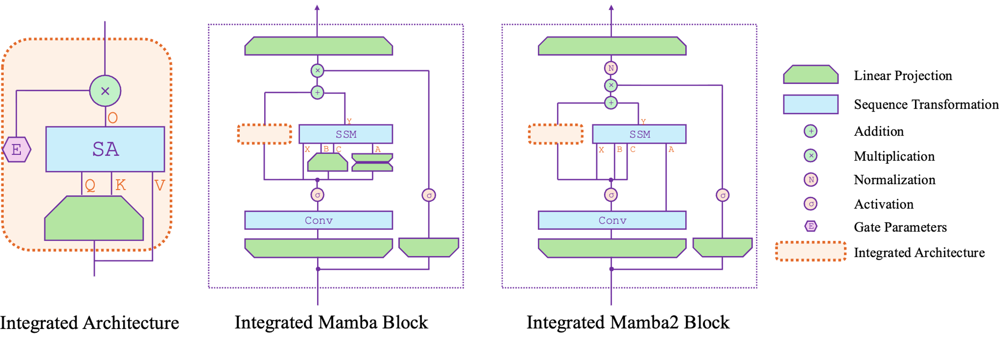
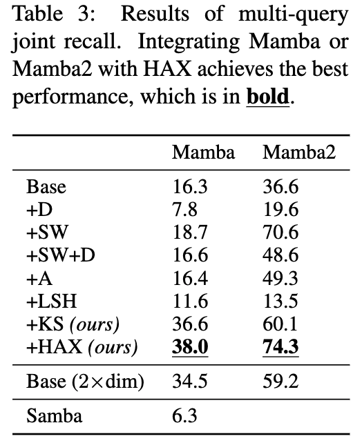

# Joint Recall and HAX

This is the official codebase of the paper [*Overcoming Long-Context Limitations of State-Space Models via Context-Dependent Sparse Attention*](https://arxiv.org/abs/2507.00449).

## Overview

We introduce ***joint recall***, a novel synthetic task that extends associative recall to context-dependent key-value association, which offers a new perspective for both theoretical analysis and empirical benchmark for long-context modeling.

<table><tr><td>
<p align="center">

</p></td></tr></table>

Guided by the theoretical analysis on ***joint recall***, we propose a novel architecture, **HAX**, based on state-space models (SSMs) integrated with context-dependent sparse attention (CDSA), which consistently outperforms SSMs and SSMs integrated with context-independent sparse attention (CISA) on both synthetic and real-world long-context benchmarks.

<table><tr><td>
<p align="center">

</p></td></tr></table>

**HAX** stands for locality-sensitive **H**ashing **A**ttention with sparse **K**ey **S**election, combining LSH and key selection (KS) attention patterns. Both LSH and KS attention are context-dependent and serve as complementary mechanisms: LSH enables flexible, content-based interactions by routing queries to similar keys, while KS provides global focus by attending to a few important positions. We further integrate SSMs with HAX, as shown in the following figure, thereby addressing the theoretical expressiveness bottleneck of SSMs as analyzed on the ***joint recall*** task.

<table><tr><td>
<p align="center">

</p></td></tr></table>

Finally, we would like to note that our ***joint recall*** task is not designed specifically for SSM optimization, but could serve as a **general-purpose tool for long-context modeling studies**.

## Installation

Please use the following versions of Python packages:

```
python==3.12.9
torch==2.6.0
transformers==4.49.0
datasets==3.4.0
triton==3.2.0
flash_attn==2.7.4.post1
mamba-ssm==2.2.4
causal-conv1d==1.5.0.post8
flash-linear-attention==0.2.0
```

## Reproduction

Our implementation is based on [Flash-Linear-Attention](https://github.com/fla-org/flash-linear-attention)

To reproduce the synthetic experiments from the paper, please run:

```
python scripts/joint_recall.py \
    --base_arch [specify_base_arch] \
    --sparse_arch [specify_sparse_arch] \
    --data_dir [path_to_dataset_cache] \
    --save_dir [path_to_save_model]
```

**Options for --base_arch:**
- Mamba
- Mamba2
- Samba

**Options for --sparse_arch:**
- None (base SSM architectures that do not include the sparse attention module)
- dilated (+D)
- sliding_window (+SW)
- sliding_window+dilated (+SW+D)
- sliding_window+sink (+A)
- sign_bin_lsh (+LSH)
- key_selection (+KS)
- sign_bin_lsh+key_selection (+HAX)

For example, to run experiments with the base Mamba SSM, use:

```
python scripts/joint_recall.py --base_arch mamba
```

To run experiments with Mamba2 integrated with HAX, use:

```
python scripts/joint_recall.py --base_arch mamba2 --sparse_arch sign_bin_lsh+key_selection
```

To reproduce the synthetic data generation described in the paper, please run:

```
python scripts/create_dataset.py --data_dir [path_to_dataset_cache]
```

By default, this script generates the joint recall dataset used in the paper, including 1.4M training samples, 14.4K validation samples, and 14.4K test samples.

Below is the joint recall experiment result reported in our paper:



## Citation

If you find this codebase useful, please cite:

```
@misc{zhan2025overcoming,
  title = {Overcoming Long-Context Limitations of State-Space Models via Context-Dependent Sparse Attention},
  author = {Zhan, Zhihao and Zhao, Jianan and Zhu, Zhaocheng and Tang, Jian},
  year = {2025},
  eprint = {2507.00449},
  archivePrefix = {arXiv},
  primaryClass = {cs.LG},
  url = {https://arxiv.org/abs/2507.00449}
}
```